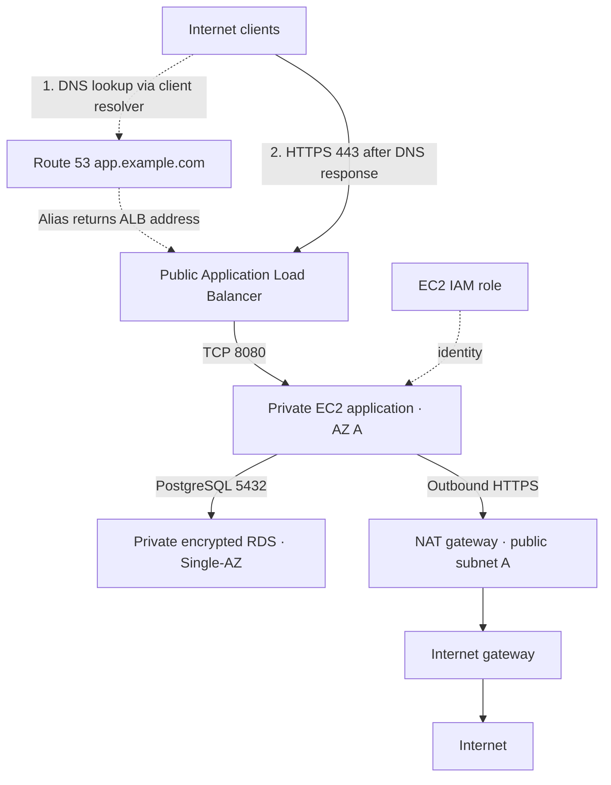
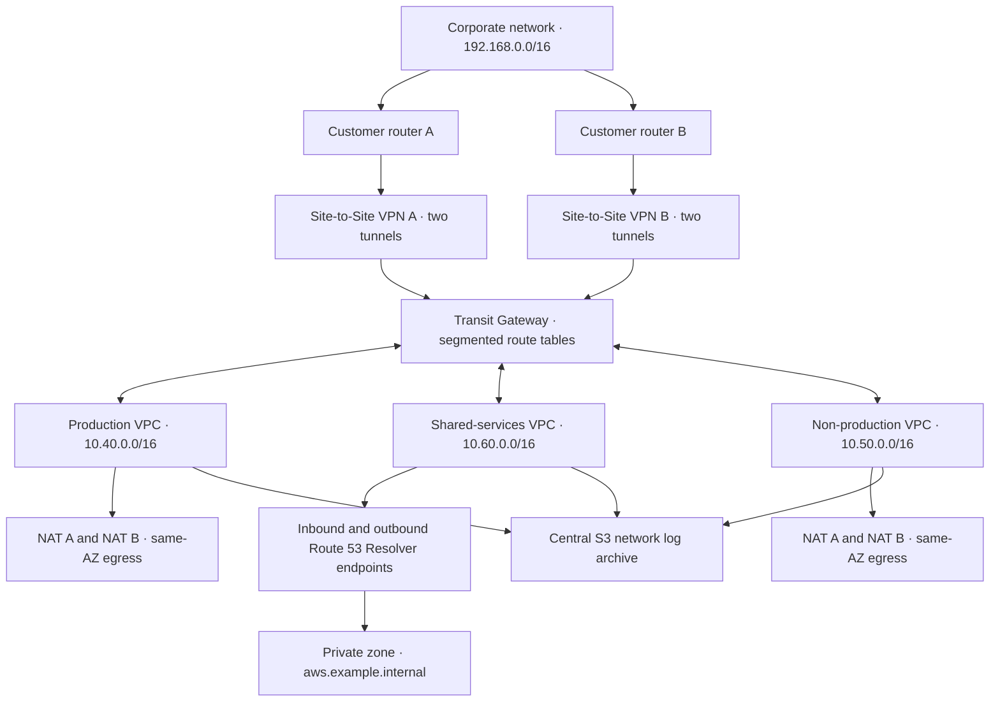

# AWS network templates

Load **Simple AWS network** or **Enterprise AWS network** from **Start from a
template**. The default service view has a saved layout; **Infrastructure** shows
VPCs, subnets, gateways, routes and security groups. Select a service to edit its
attachments. **Architecture notes** contains the template's saved design intent.

These are architecture starting points, not deployable Terraform or a certification
of availability. Both use illustrative IPv4 addressing in `eu-west-1a` and
`eu-west-1b`. Adapt the ranges to your IPAM allocation and existing networks before
deployment. AZ letters are account-specific: confirm physical AZ IDs when coordinating
multiple accounts. Instance sizes, traffic, surviving capacity, costs and service-level
targets are left undeclared rather than invented.

## Simple AWS network

Designed for a small application with modest infrastructure cost and straightforward
access controls. One application instance, one NAT gateway and a Single-AZ database
are explicit failure points. Two-AZ public and database subnet choices allow later
growth; they do not make those single components highly available.

| Network | AZ A | AZ B | Purpose |
|---|---|---|---|
| VPC | `10.20.0.0/16` | Same VPC | One network boundary |
| Public | `10.20.0.0/24` | `10.20.1.0/24` | ALB in both AZs; NAT in A |
| Application | `10.20.10.0/24` | `10.20.11.0/24` | EC2 in A; B reserved for expansion |
| Database | `10.20.20.0/24` | `10.20.21.0/24` | DB subnet group; no public address or internet route |

| Route table | Associations | Routes |
|---|---|---|
| Public | Public A/B | VPC local route; `0.0.0.0/0` → internet gateway |
| Application | App A/B | VPC local route; `0.0.0.0/0` → NAT A |
| Database | Data A/B | VPC local route only |

Security groups permit internet clients to reach only ALB TCP 443, the ALB to
reach only application TCP 8080, and the application's group to reach database TCP
5432. Application egress permits database traffic and outbound HTTPS. There is no
inbound SSH or RDP rule. The EC2 role has an explicit EC2 trust policy; deployment
must attach the permissions needed by the workload and Systems Manager. No wildcard
permissions are provided. All subnets use an explicit permissive NACL baseline;
the security groups provide the workload permission boundaries.

TLS terminates at the ALB in this small-system example. Attach an ACM certificate
for your domain and configure application health checks at deployment. RDS is
declared encrypted and private, with deletion protection and seven days of backup
retention. Backup configuration is not evidence of a successful restore or an RTO.

Four journeys are included: the complete internet → ALB → application → database
request and three individual-hop checks. The canvas shows the client's DNS connection
to Route 53 separately from the HTTPS connection to the ALB. Route 53 returns the ALB's
address through the client's DNS resolver; the browser sends HTTP traffic to that
address, not through Route 53. See [AWS's DNS request sequence](https://docs.aws.amazon.com/Route53/latest/DeveloperGuide/welcome-dns-service.html).
The saved `design_dns_client` and `design_alias` values describe this relationship.
They do not establish that DNS is healthy, authorize traffic, or add a TCP 443 hop
through a DNS service. The Internet clients card is a display of the declared internet
origin, not an extra AWS resource in the assessment input.

**Follow traffic** illustrates the declared DNS lookup in blue, explicitly labelled
as unassessed, then replays the backend's HTTPS/application checks and stops at the
unmodelled EC2 hop. The enterprise public request uses the same DNS-first presentation.
The checked-in failure fixture removes
the EC2 application and exposes its
structural failure impact. The current backend can assess the HTTPS entry hop;
EC2 request simulation remains unsupported. Use that unknown result as a model limit,
not a failed network design.

## Enterprise AWS network

A regional hub-and-spoke foundation for production, non-production and shared
services, using separate account roles. Transit Gateway lives in the network/shared
services account and is shared with workload accounts. Distributed egress keeps each
workload AZ's NAT gateway independent of the other AZ. This deliberately spends more
on NAT resources to avoid a shared zonal egress dependency.

The arrows represent attachments and approved routing intent. They do not give every
spoke permission to communicate with every other spoke. TGW segmentation, security
groups, DNS rules and account permissions still determine actual access.

| Account role / VPC | CIDR | AZ A / AZ B subnet pairs |
|---|---|---|
| Production | `10.40.0.0/16` | Public `.0.0/24`, `.1.0/24`; app `.10.0/24`, `.11.0/24`; data `.20.0/24`, `.21.0/24`; TGW attachment `.250.0/24`, `.251.0/24` |
| Non-production | `10.50.0.0/16` | Public `.0.0/24`, `.1.0/24`; app `.10.0/24`, `.11.0/24`; TGW attachment `.250.0/24`, `.251.0/24` |
| Network and shared services | `10.60.0.0/16` | DNS services `.10.0/24`, `.11.0/24`; TGW attachment `.250.0/24`, `.251.0/24` |
| Corporate network example | `192.168.0.0/16` | Corporate resolvers `192.168.10.10` and `192.168.10.11` |

The shorthand subnet octets above expand under the VPC's first two octets: production
app A is `10.40.10.0/24`. Each VPC attachment selects one dedicated transit subnet per
AZ. Their route tables keep the VPC local route for traffic returning from TGW.

### Routing and environment separation

Default TGW route-table association and propagation are disabled. Use explicit
attachment associations and only the listed routes/propagation. The template retains
this policy as `design_route_tables` on the TGW, plus attachment selections on each
VPC and planned TGW routes on VPC route tables.

| TGW table | Associated attachments | Allowed routes | Explicit exclusions |
|---|---|---|---|
| Production | Production VPC | Shared-services CIDR; corporate routes learned from both VPNs | Blackhole non-production CIDR |
| Non-production | Non-production VPC | Shared-services CIDR | Blackhole production CIDR; no corporate route |
| Shared | Shared-services VPC | Production and non-production CIDRs; corporate routes learned from both VPNs | No internet default route |
| Hybrid | Both VPN connections | Production and shared-services CIDRs | Blackhole non-production CIDR |

Production and non-production private app route tables each have their own AZ-local
`0.0.0.0/0` → NAT route. More-specific shared-services routes target TGW. Only production
gets a corporate CIDR route. Public subnets have a default route to their VPC's IGW.
Database subnets have only VPC local routes, with no NAT, IGW or TGW routes. Shared
DNS service subnets have private TGW routes to the workload and corporate CIDRs, and
no internet default route.

TGW is a routing boundary, not a substitute for traffic inspection or application
authorization. This template does not claim an AWS Network Firewall deployment or
centralized inspection. Add that control if required by the organization's threat
model, with symmetric inspected routing and suitable capacity. Keep shared services
from acting as an unauthorized proxy between production and non-production.

### Hybrid DNS and connectivity

Two distinct customer routers each have a separate Site-to-Site VPN connection.
Configure both tunnels on each connection and BGP advertisements for the corporate
prefix. Router addresses, customer ASNs, tunnel authentication and routing preference
must be supplied during implementation. No VPN throughput or convergence time is
claimed. Direct Connect can be added where bandwidth, latency or policy requires it;
the current starting point uses VPN and does not invent a circuit commitment.

Inbound Resolver addresses are `10.60.10.10` and `10.60.11.10`; the corporate resolvers
forward `aws.example.internal` queries to them. The private hosted zone is associated
with all three VPCs. Outbound Resolver addresses are `10.60.10.11` and `10.60.11.11`;
forwarding rules for `corp.example.internal` target both corporate resolvers and are
associated with the VPCs. Configure cross-account hosted-zone associations and Resolver
rule sharing during deployment. Endpoint security groups allow only DNS TCP/UDP 53
from/to the specified corporate resolver addresses.

### Workload security, operations and resilience

Production ingress is HTTPS 443 at the ALB, then HTTPS 8443 to the private application.
The app's security group accepts that port only from the ALB group. Database ingress
is TCP 5432 only from the application group. Production NACLs enforce tier-specific
ports and include explicit TCP ephemeral return ranges `1024–65535`. Shared DNS ACLs
include TCP/UDP DNS and return traffic. Transit attachment ACLs have an explicit
permissive baseline; TGW policy and resource security groups define access. The
non-production baseline is deliberately less granular and is documented as such.

The representative EKS application components declare private control-plane access;
they stand for aggregate workload clusters in Preflight's existing model. Kubernetes
workloads, cluster security groups, worker security groups, network policies, TLS
certificates and application health checks still need implementation. Cluster IAM
trust roles are included; runtime/pod permissions remain workload-specific. No
inbound SSH/RDP access is provided. RDS declares encryption, Multi-AZ, private access,
deletion protection and 35-day backup retention. Two-AZ placement and a Multi-AZ flag
do not establish surviving capacity, failover duration or an availability SLO.

All three VPCs record an ALL-traffic flow-log delivery intent to the central S3 archive.
The archive records encryption, public-access-block and retention intentions. Implement
the actual flow-log resources, log-delivery bucket policies, least-privilege readers,
lifecycle retention, alerting and incident runbooks before deployment. Those notes are
not a claim that log delivery or IAM authorization has been evaluated.

### What the application can assess today

The six enterprise journeys include the complete application request plus public HTTPS, the internal application port,
the isolated database, hybrid DNS through parallel VPN connections, and non-production
access to the shared network hub. The production HTTPS and ALB → application TCP
hops are assessed using the existing SG/NACL engine. This does not test TLS handshakes.
Removing the app's ingress rule blocks the latter hop at the security-group step.
**Follow traffic** starts with the complete request: ingress on 443, application on
8443 and database on 5432. It pauses at the database's unmodelled local-only routing,
retaining the isolated subnet design.

Transit Gateway, VPN and Resolver routing are unmodelled. Their AWS identities and
planning values are preserved, and journeys crossing them return `not_assessable`.
The backend's current subnet resolver also cannot assess an empty local-only data
route table. The data journey therefore remains unknown. No database NAT route is
added merely to produce a passing simulation. The checked-in failure fixture removes
the production aggregate application node and records what the real engine returns.

### AWS design references

- [Transit Gateway attachments, routing and isolation](https://docs.aws.amazon.com/vpc/latest/tgw/transit-gateway-isolated-shared.html)
- [VPC attachment requirements](https://docs.aws.amazon.com/vpc/latest/tgw/tgw-vpc-attachments.html)
- [NAT gateways and AZ-local routing](https://docs.aws.amazon.com/vpc/latest/userguide/nat-gateway-basics.html)
- [Security group behavior](https://docs.aws.amazon.com/vpc/latest/userguide/vpc-security-groups.html)
- [Subnet route tables and the local route](https://docs.aws.amazon.com/vpc/latest/userguide/subnet-route-tables.html)
- [Network ACL directionality and return traffic](https://docs.aws.amazon.com/vpc/latest/userguide/vpc-network-acls.html)
- [Redundant VPN connections](https://docs.aws.amazon.com/vpn/latest/s2svpn/vpn-redundant-connection.html)
- [Hybrid Resolver endpoints and forwarding rules](https://docs.aws.amazon.com/Route53/latest/DeveloperGuide/resolver-overview-DSN-queries-to-vpc.html)
